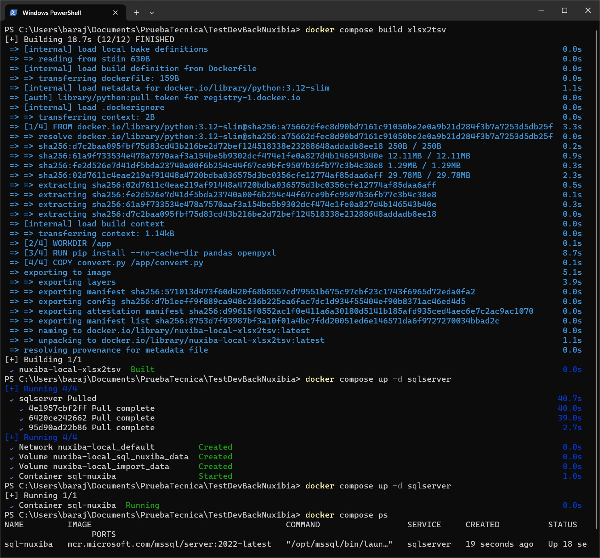
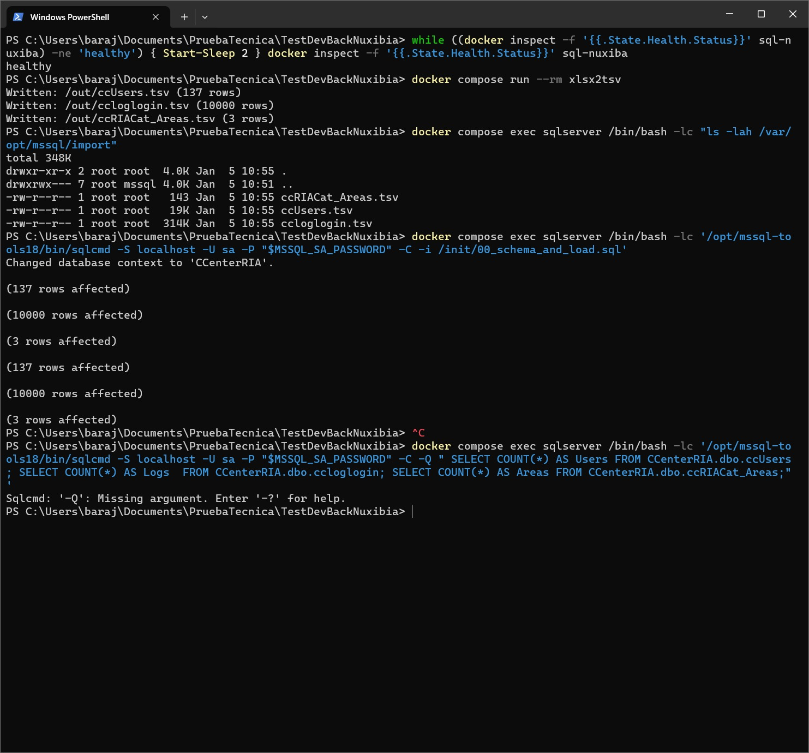
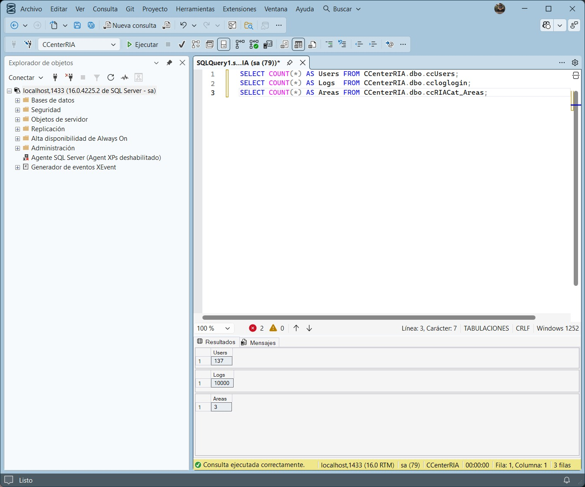

# EVALUACIÓN TÉCNICA NUXIBA

Prueba: **DESARROLLADOR JR**

Deadline: **1 día**

Nombre: Luis Angel Barajas Arroyo

---

## Clona y crea tu repositorio para la evaluación

1. Clona este repositorio en tu máquina local.
2. Crea un repositorio público en tu cuenta personal de GitHub, BitBucket o Gitlab.
3. Cambia el origen remoto para que apunte al repositorio público que acabas de crear en tu cuenta.
4. Coloca tu nombre en este archivo README.md y realiza un push al repositorio remoto.

---

## Instrucciones Generales

1. Cada pregunta tiene un valor asignado. Asegúrate de explicar tus respuestas y mostrar las consultas o procedimientos que utilizaste.
2. Se evaluará la claridad de las explicaciones, el pensamiento crítico, y la eficiencia de las consultas.
3. Utiliza **SQL Server** para realizar todas las pruebas y asegúrate de que las consultas funcionen correctamente antes de entregar.
4. Justifica tu enfoque cuando encuentres una pregunta sin una única respuesta correcta.
5. Configura un Contenedor de **SQL Server con Docker** utilizando los siguientes pasos:

### Pasos para ejecutar el contenedor de SQL Server

Asegúrate de tener Docker instalado y corriendo en tu máquina. Luego, ejecuta el siguiente comando para levantar un contenedor con SQL Server:

```bash
docker run -e 'ACCEPT_EULA=Y' -e 'SA_PASSWORD=YourStrong!Passw0rd'    -p 1433:1433 --name sqlserver -d mcr.microsoft.com/mssql/server:2019-latest
```

6. Conéctate al servidor de SQL con cualquier herramienta como **SQL Server Management Studio** o **Azure Data Studio** utilizando las siguientes credenciales:
   - **Servidor**: localhost, puerto 1433
   - **Usuario**: sa
   - **Contraseña**: YourStrong!Passw0rd

---

# Examen Práctico para Desarrollador Junior en .NET 8 y SQL Server

**Tiempo estimado:** 1 día  
**Total de puntos:** 100

---

## Instrucciones Generales:

El examen está compuesto por tres ejercicios prácticos. Sigue las indicaciones en cada uno y asegúrate de entregar el código limpio y funcional.

Además, se proporciona un archivo **CCenterRIA.xlsx** para que te bases en la estructura de las tablas y datos proporcionados.

[Descargar archivo de ejemplo](CCenterRIA.xlsx)

---

## Ejercicio 1: API RESTful con ASP.NET Core y Entity Framework (40 puntos)

**Instrucciones:**  
Desarrolla una API RESTful con ASP.NET Core y Entity Framework que permita gestionar el acceso de usuarios.

1. **Creación de endpoints**:
   - **GET /logins**: Devuelve todos los registros de logins y logouts de la tabla `ccloglogin`. (5 puntos)
   - **POST /logins**: Permite registrar un nuevo login/logout. (5 puntos)
   - **PUT /logins/{id}**: Permite actualizar un registro de login/logout. (5 puntos)
   - **DELETE /logins/{id}**: Elimina un registro de login/logout. (5 puntos)

2. **Modelo de la entidad**:  
   Crea el modelo `Login` basado en los datos de la tabla `ccloglogin`:
   - `User_id` (int)
   - `Extension` (int)
   - `TipoMov` (int) → 1 es login, 0 es logout
   - `fecha` (datetime)

3. **Base de datos**:  
   Utiliza **Entity Framework Core** para crear la tabla en una base de datos SQL Server basada en este modelo. Aplica migraciones para crear la tabla en la base de datos. (10 puntos)

4. **Validaciones**:  
   Implementa las validaciones necesarias para asegurar que las fechas sean válidas y que el `User_id` esté presente en la tabla `ccUsers`. Además, maneja errores como intentar registrar un login sin un logout anterior. (10 puntos)

5. **Pruebas Unitarias** (Opcional):  
   Se valorará si incluyes pruebas unitarias para los endpoints de tu API utilizando un framework como **xUnit** o **NUnit**. (Puntos extra)

---

## Ejercicio 2: Consultas SQL y Optimización (30 puntos)

**Instrucciones:**

Trabaja en SQL Server y realiza las siguientes consultas basadas en la tabla `ccloglogin`:

1. **Consulta del usuario que más tiempo ha estado logueado** (10 puntos):
   - Escribe una consulta que devuelva el usuario que ha pasado más tiempo logueado. Para calcular el tiempo de logueo, empareja cada "login" (TipoMov = 1) con su correspondiente "logout" (TipoMov = 0) y suma el tiempo total por usuario.

   Ejemplo de respuesta:  
   - `User_id`: 92  
   - Tiempo total: 361 días, 12 horas, 51 minutos, 8 segundos

2. **Consulta del usuario que menos tiempo ha estado logueado** (10 puntos):
   - Escribe una consulta similar a la anterior, pero que devuelva el usuario que ha pasado menos tiempo logueado.

   Ejemplo de respuesta:  
   - `User_id`: 90  
   - Tiempo total: 244 días, 43 minutos, 15 segundos

3. **Promedio de logueo por mes** (10 puntos):
   - Escribe una consulta que calcule el tiempo promedio de logueo por usuario en cada mes.

   Ejemplo de respuesta:  
   - Usuario 70 en enero 2023: 3 días, 14 horas, 1 minuto, 16 segundos

---

## Ejercicio 3: API RESTful para generación de CSV (30 puntos)

**Instrucciones:**

1. **Generación de CSV**:  
   Crea un endpoint adicional en tu API que permita generar un archivo CSV con los siguientes datos:
   - Nombre de usuario (`Login` de la tabla `ccUsers`)
   - Nombre completo (combinación de `Nombres`, `ApellidoPaterno`, y `ApellidoMaterno` de la tabla `ccUsers`)
   - Área (tomado de la tabla `ccRIACat_Areas`)
   - Total de horas trabajadas (basado en los registros de login y logout de la tabla `ccloglogin`)

   El CSV debe calcular el total de horas trabajadas por usuario sumando el tiempo entre logins y logouts.

2. **Formato y Entrega**:
   - El CSV debe ser descargable a través del endpoint de la API.
   - Asegúrate de probar este endpoint utilizando herramientas como **Postman** o **curl** y documenta los pasos en el archivo README.md.

---

## Entrega

1. Sube tu código a un repositorio en GitHub o Bitbucket y proporciona el enlace para revisión.
2. El repositorio debe contener las instrucciones necesarias en el archivo **README.md** para:
   - Levantar el contenedor de SQL Server.
   - Conectar la base de datos.
   - Ejecutar la API y sus endpoints.
   - Descargar el CSV generado.
3. **Opcional**: Si incluiste pruebas unitarias, indica en el README cómo ejecutarlas.

---

Este examen evalúa tu capacidad para desarrollar APIs RESTful, realizar consultas avanzadas en SQL Server y generar reportes en formato CSV. Se valorará la organización del código, las mejores prácticas y cualquier documentación adicional que proporciones.

# TestDevBackNuxibia

Este repositorio contiene un entorno **reproducible** para levantar **SQL Server 2022 Developer** en Docker y **cargar datos** desde `CCenterRIA.xlsx` mediante un flujo **XLSX → TSV → BULK INSERT** (compatible con SQL Server en Linux).

---

## Requisitos

- Docker Desktop (backend WSL2)
- Git
- (Opcional) SQL Server Management Studio (SSMS) o Azure Data Studio para validar

---

## Quick Start

### 1) Configurar variables
1. Crea tu archivo `.env` a partir del ejemplo:
```bash
copy .env.example .env
```

2. Edita `.env` y define la contraseña:
```env
MSSQL_SA_PASSWORD=Str0ng!Passw0rd#2026
```

> Asegúrate de usar una contraseña fuerte (mayúsculas/minúsculas/números/símbolos).

---

### 2) Build del loader (XLSX → TSV)
```bash
docker compose build xlsx2tsv
```

---

### 3) Levantar SQL Server
```bash
docker compose up -d sqlserver
docker compose ps
```

---

### 4) Esperar a que SQL Server esté "healthy"
**PowerShell:**
```powershell
while ((docker inspect -f '{{.State.Health.Status}}' sql-nuxiba) -ne 'healthy') { Start-Sleep 2 }
docker inspect -f '{{.State.Health.Status}}' sql-nuxiba
```

---

### 5) Convertir XLSX → TSV
Este paso genera los archivos `.tsv` en el volumen `import_data`:
```bash
docker compose run --rm xlsx2tsv
```

---

### 6) Ejecutar esquema + carga de datos
Ejecuta el script desde dentro del contenedor para evitar problemas de red:
```bash
docker compose exec sqlserver /bin/bash -lc '/opt/mssql-tools18/bin/sqlcmd -S localhost -U sa -P "$MSSQL_SA_PASSWORD" -C -i /init/00_schema_and_load.sql'
```

---

### 7) Verificación (conteos esperados)
**Esperado:** `Users=137`, `Logs=10000`, `Areas=3`

```bash
docker compose exec sqlserver /bin/bash -lc '/opt/mssql-tools18/bin/sqlcmd -S localhost -U sa -P "$MSSQL_SA_PASSWORD" -C -Q "
SELECT COUNT(*) AS Users FROM CCenterRIA.dbo.ccUsers;
SELECT COUNT(*) AS Logs  FROM CCenterRIA.dbo.ccloglogin;
SELECT COUNT(*) AS Areas FROM CCenterRIA.dbo.ccRIACat_Areas;"'
```

---

## Estructura del repositorio

- `compose.yml` → define servicios y volúmenes
- `db/source/CCenterRIA.xlsx` → archivo fuente (Excel)
- `db/init/00_schema_and_load.sql` → creación de DB + BULK INSERT + carga tipada
- `tools/xlsx2tsv/` → contenedor Python para convertir XLSX a TSV

---

## Evidencia (screenshots)

Guarda tus capturas en:
- `docs/evidence/`

Nombres sugeridos:
- `01-build-xlsx2tsv.png`
- `02-sqlserver-up.png`
- `03-xlsx2tsv-output.png`
- `04-import-folder.png`
- `05-seed-success.png`
- `06-ssms-counts.png`

Luego referencia así:

### Docker Compose + Loader



### Validación de datos


---

## Reset / Re-ejecución limpia

Borra contenedores, red y volúmenes (incluye data):
```bash
docker compose down -v --remove-orphans
```

Recrear todo:
```bash
docker compose build xlsx2tsv
docker compose up -d sqlserver
docker compose run --rm xlsx2tsv
docker compose exec sqlserver /bin/bash -lc '/opt/mssql-tools18/bin/sqlcmd -S localhost -U sa -P "$MSSQL_SA_PASSWORD" -C -i /init/00_schema_and_load.sql'
```

---

## Troubleshooting (rápido)

- **SQL Server tarda en iniciar:**  
  Revisa logs:
  ```bash
  docker compose logs -f sqlserver
  ```

- **No existen TSV en el contenedor:**  
  Verifica carpeta import:
  ```bash
  docker compose exec sqlserver /bin/bash -lc "ls -lah /var/opt/mssql/import"
  ```

- **Reiniciar desde cero (sin residuos):**  
  ```bash
  docker compose down -v --remove-orphans
  ```
